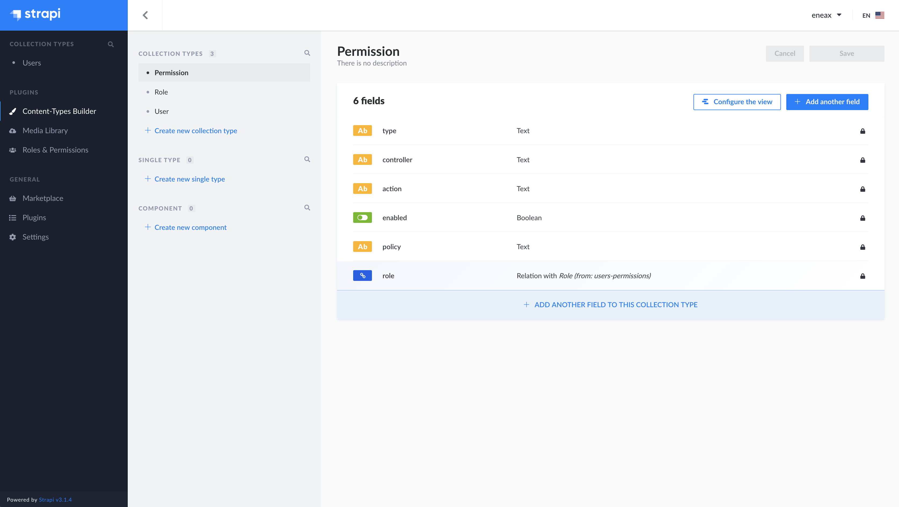
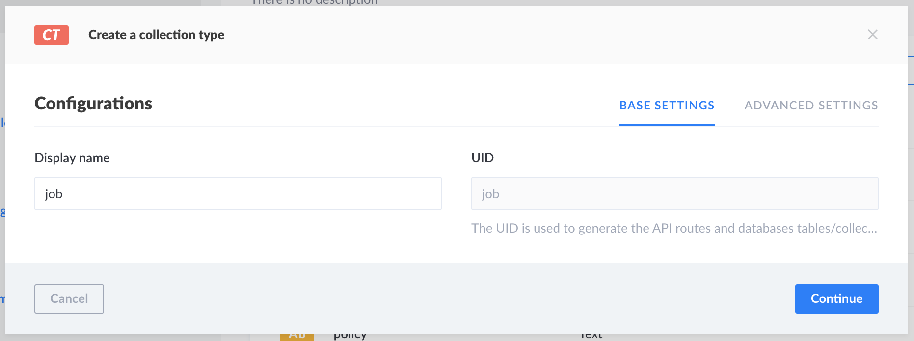
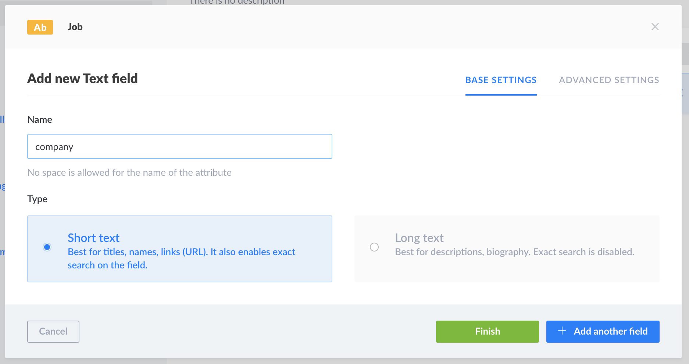
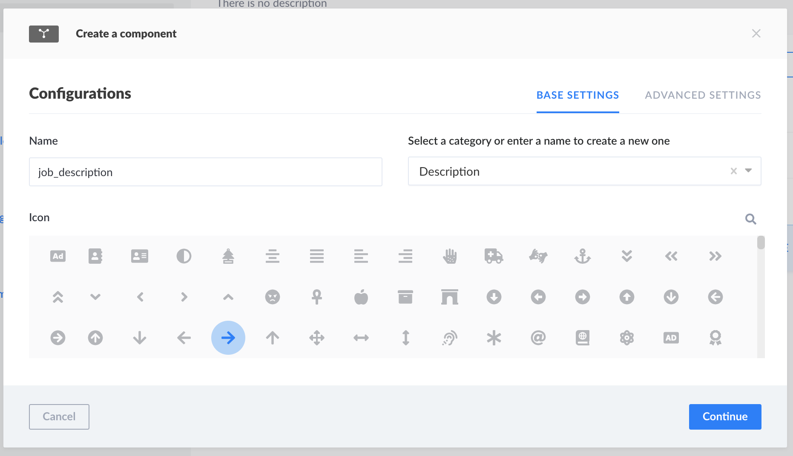

# Strapi application

(once you deploy your app, you need to setup the admin from scratch)

### 1. Install Strapi locally

```bash
npx create-strapi-app gatsby-dev-portfolio-api --quickstart
```

### 2. Create an Administrator user (root-admin)

Navigate to http://localhost:1337/admin.

Complete the form to create the first Administrator user.
Click Ready to start.

### 3. Create your first Content-Type

A `Content-Type` just gives you a structure for your data.



Log in into your Strapi admin dashboard and click on `Content-Type Builder`.
You'll see already some content types that are already there by default, like: `Permission`, `Role` and `User`.

Click on `Create new collection type`.

- add a name (remember to use the singular, since Strapi will make it plural)



- select `fields` (as required fields in the `Advanced Settings` tab)



### 4. Create a Strapi component

Inside `Content-Types`, we can setup also a Strapi component.
It's very useful for repeatable data (i.e. <li>) and it can be reused in multiple `Content-Types`.

Click on `Create new component`.



### 5. Update permissions

Once you are done creating a content type, you can move on and add some entries.
Then, keep in mind that you need to update the permissions if you want to expose data to unauthenticated users.

For more info, make sure to check out the [official docs](https://strapi.io/documentation/v3.x/getting-started/quick-start.html).
